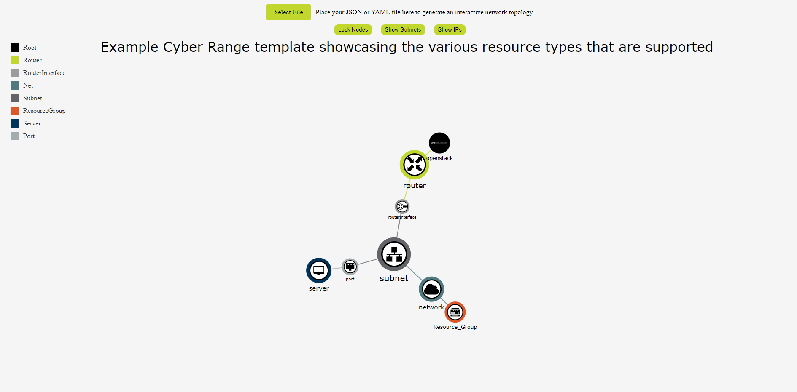

# OpenStack Topology Graph

[Topology Graph](https://topology.gacyberrange.org)

This project provides a web app GUI for generating a topological graph of Heat Orchestration Templates.
It can be used to dynamically manage associated network maps and provide an interactive topology.
It recursively extracts the input data and formats it into a D3.js force simulation.

The webpage uses [D3.js](https://d3js.org/) version 7 and [Cloudflare's](https://cdnjs.cloudflare.com/) JSON and YAML parsing library version 3.14.1.
## Usage

### Quick Start:
1. Navigate to https://topology.gacyberrange.org
2. Click on the "Select File" button
3. Upload your JAML or JSON heat template

It should look something like this:

### Features:
1. Force Simulation
2. Dragging and Dropping
3. Panning
4. Zooming
5. Device Tooltips
6. Legend and Title
7. Toggleable Options Buttons

### Options Buttons:
1. Lock Nodes - Locks each node in place (they still can be dragged).
2. Show Subnets - Draws a polygon hull around Subnets and their dependencies
3. Show IPs - Replaces all the node names with the node IPs if applicable

## Contributing

[OpenStack Topology Graph Gitlab Repository](https://gitlab.com/gacybercenter/open/openstack-top-graph)

Pull requests are welcome. For major changes, please open an issue first
to discuss what you would like to change.

Please make sure to update the examples as appropriate.

## License

Copyright 2020 Augusta University

Licensed under the Apache License, Version 2.0 (the "License");
you may not use this file except in compliance with the License.
You may obtain a copy of the License at

   http://www.apache.org/licenses/LICENSE-2.0

Unless required by applicable law or agreed to in writing, software
distributed under the License is distributed on an "AS IS" BASIS,
WITHOUT WARRANTIES OR CONDITIONS OF ANY KIND, either express or implied.
See the License for the specific language governing permissions and
limitations under the License.

[AU Intellectual Property Policy](https://www.augusta.edu/services/legal/policyinfo/policy/intellectual-property-policy.pdf)
