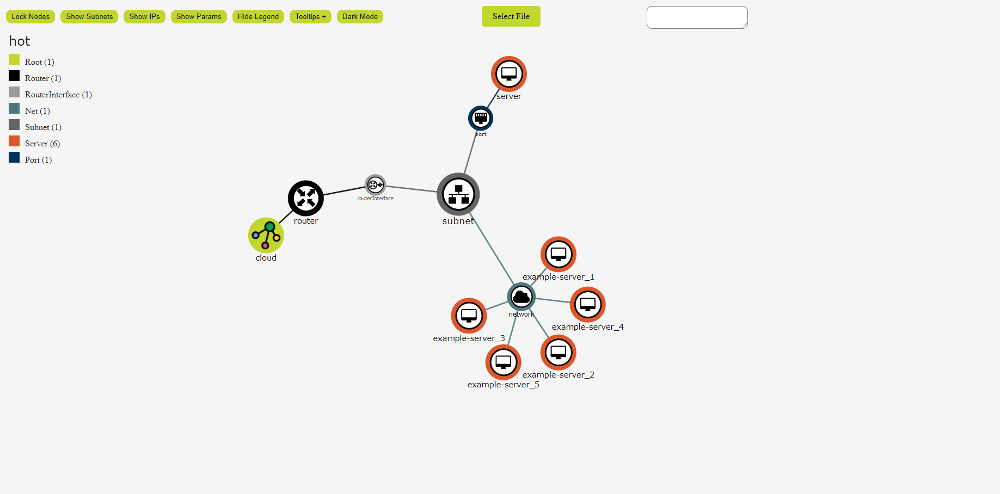
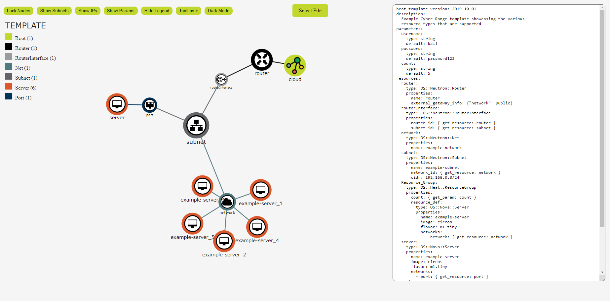

# OpenStack Topology Graph v1.0

This project provides a web app GUI for generating a topological graph of Heat Orchestration Templates.
It can be used to dynamically manage associated network maps and provide an interactive topology.
It recursively extracts the input data and formats it into a D3.js force simulation.

The webpage uses [D3.js](https://d3js.org/) version 7 and [Cloudflare](https://cdnjs.cloudflare.com/)'s JSON and YAML parsing library version 3.14.1.

### Disclaimer:
_Still under development. There are some bugs._
### Supported resource types:
- Net
- Subnet
- Router
- RouterInterface
- Server
- Port
- FloatingIP
- ResourceGroup
- SecurityGroup
- ExtraRoute
- WaitCondition
- WaitConditionHandle
- MultipartMime
- SoftwareConfig
- RandomString
- RecordSet
- Zone

## Usage
### Quick Start:
1. Navigate to https://topology.gacyberrange.org 
   _Or host the index.html file locally_
2. Click on the "Select File" button or the text box
3. Upload your YAML or JSON heat template

It should look something like this:

Or this:

### Features:

1. YAML and JSON Parsing
2. Force Simulation
3. Dragging
4. Panning
5. Zooming
6. Device Tooltips
7. Toggleable Options

### Options Buttons:
- **Lock Nodes** 
   _Locks each node in place (they can still be dragged)_
- **Show Subnets** 
   _Draws a polygon hull around Subnets and their dependencies_
- **Show IPs** 
   _Replaces all the node names with the node IPs if applicable_
- **Show Params** 
   _Lists the heat temlate description and parameters_
- **Hide Legend** 
   _Hides the device type legend_
- **Tooltips +** 
   _Shows hidden tooltip information_
- **Darkmode** 
   _Makes the background darker and text lighter_

## Contributing

[OpenStack Topology Graph Gitlab Repository](https://gitlab.com/gacybercenter/open/openstack-top-graph)

Pull requests are welcome. For major changes, please open an issue first
to discuss what you would like to change.

Please make sure to update the examples as appropriate.

## License

Copyright 2020 Augusta University

[Augusta University Intellectual Property Policy](https://www.augusta.edu/services/legal/policyinfo/policy/intellectual-property-policy.pdf)

Licensed under the Apache License, Version 2.0 (the "License");
you may not use this file except in compliance with the License.
You may obtain a copy of the License at

   http://www.apache.org/licenses/LICENSE-2.0

Unless required by applicable law or agreed to in writing, software
distributed under the License is distributed on an "AS IS" BASIS,
WITHOUT WARRANTIES OR CONDITIONS OF ANY KIND, either express or implied.
See the License for the specific language governing permissions and
limitations under the License.